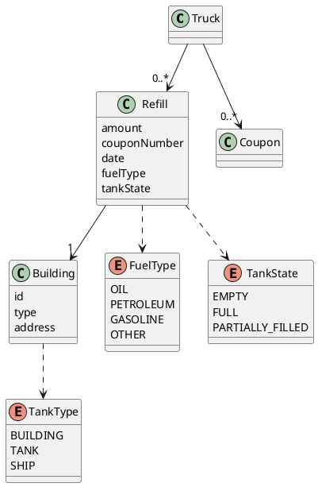

# Entity Datamodel

## Diagram

```plantuml
@startuml
class Truck {

}

class Building {
    id 
    type
    address
}

class Refill {
    amount
    couponNumber
    date
    fuelType
    tankState
}

enum FuelType {
    OIL
    PETROLEUM
    GASOLINE
    OTHER
}

enum TankType {
    BUILDING
    TANK
    SHIP
}

enum TankState {
  EMPTY
  FULL
  PARTIALLY_FILLED
}

class Coupon {

}

Truck --> "0..*" Refill 
Refill --> "1" Building
Refill ..> FuelType
Building ..> TankType
Refill ..> TankState
Truck --> "0..*" Coupon
@enduml

```

## Entities

### Refill

### Route 
### Tank

