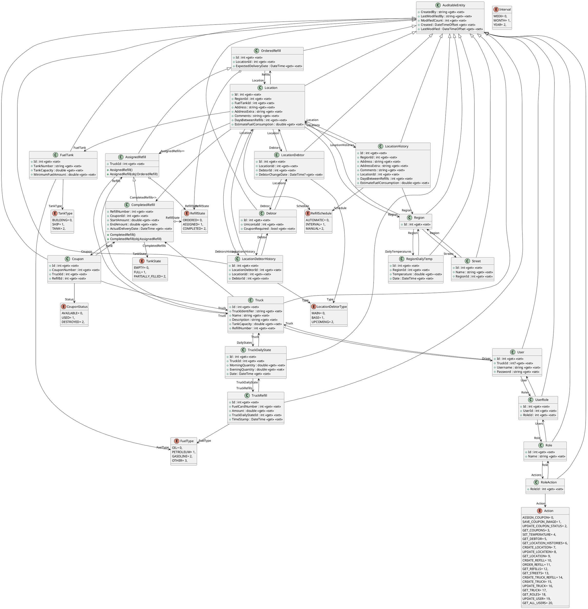

# Entity Datamodel

## Diagram

```plantuml
@startuml
class AuditableEntity {
    + CreatedBy : string <<get>> <<set>>
    + LastModifiedBy : string <<get>> <<set>>
    + ModifiedCount : int <<get>> <<set>>
    + Created : DateTimeOffset <<get>> <<set>>
    + LastModified : DateTimeOffset <<get>> <<set>>
}
class Coupon {
    + Id : int <<get>> <<set>>
    + CouponNumber : int <<get>> <<set>>
    + TruckId : int <<get>> <<set>>
    + RefillId : int <<get>> <<set>>
}
AuditableEntity <|-- Coupon
Coupon --> "Truck" Truck
Coupon --> "Status" CouponStatus
Coupon --> "Refill" CompletedRefill
class Debtor {
    + Id : int <<get>> <<set>>
    + UnicontaId : int <<get>> <<set>>
    + CouponRequired : bool <<get>> <<set>>
}

AuditableEntity <|-- Debtor
Debtor --> "Locations" LocationDebtor
Debtor --> "LocationsHistory" LocationDebtorHistory

class FuelTank {
    + Id : int <<get>> <<set>>
    + TankNumber : string <<get>> <<set>>
    + TankCapacity : double <<get>> <<set>>
    + MinimumFuelAmount : double <<get>> <<set>>
}
AuditableEntity <|-- FuelTank
FuelTank --> "TankType" TankType
FuelTank --> "FuelType" FuelType
class Location {
    + Id : int <<get>> <<set>>
    + RegionId : int <<get>> <<set>>
    + FuelTankId : int <<get>> <<set>>
    + Address : string <<get>> <<set>>
    + AddressExtra : string <<get>> <<set>>
    + Comments : string <<get>> <<set>>
    + DaysBetweenRefills : int <<get>> <<set>>
    + EstimateFuelConsumption : double <<get>> <<set>>
}


AuditableEntity <|-- Location
Location --> "Region" Region
Location --> "FuelTank" FuelTank
Location --> "Schedule" RefillSchedule
Location --> "Refills" OrderedRefill
Location --> "AssignedRefills<>" AssignedRefill
Location --> "CompletedRefills<>" CompletedRefill
Location --> "LocationHistories" LocationHistory
Location --> "Debtors" LocationDebtor
Location --> "DebtorsHistory" LocationDebtorHistory
class LocationDebtor {
    + Id : int <<get>> <<set>>
    + LocationId : int <<get>> <<set>>
    + DebtorId : int <<get>> <<set>>
    + DebtorChangeDate : DateTime? <<get>> <<set>>
}
AuditableEntity <|-- LocationDebtor
LocationDebtor --> "Type" LocationDebtorType
LocationDebtor --> "Location" Location
LocationDebtor --> "Debtor" Debtor
class LocationDebtorHistory {
    + Id : int <<get>> <<set>>
    + LocationDebtorId : int <<get>> <<set>>
    + LocationId : int <<get>> <<set>>
    + DebtorId : int <<get>> <<set>>
}
AuditableEntity <|-- LocationDebtorHistory
LocationDebtorHistory --> "Type" LocationDebtorType
LocationDebtorHistory --> "Location" Location
LocationDebtorHistory --> "Debtor" Debtor
class LocationHistory {
    + Id : int <<get>> <<set>>
    + RegionId : int <<get>> <<set>>
    + Address : string <<get>> <<set>>
    + AddressExtra : string <<get>> <<set>>
    + Comments : string <<get>> <<set>>
    + LocationId : int <<get>> <<set>>
    + DaysBetweenRefills : int <<get>> <<set>>
    + EstimateFuelConsumption : double <<get>> <<set>>
}
AuditableEntity <|-- LocationHistory
LocationHistory --> "Region" Region
LocationHistory --> "Schedule" RefillSchedule
LocationHistory --> "Location" Location
class Region {
    + Id : int <<get>> <<set>>
}

AuditableEntity <|-- Region
Region --> "Locations" Location
Region --> "DailyTemperatures" RegionDailyTemp
Region --> "Streets" Street
class RegionDailyTemp {
    + Id : int <<get>> <<set>>
    + RegionId : int <<get>> <<set>>
    + Temperature : double <<get>> <<set>>
    + Date : DateTime <<get>> <<set>>
}
AuditableEntity <|-- RegionDailyTemp
RegionDailyTemp --> "Region" Region
class Role {
    + Id : int <<get>> <<set>>
    + Name : string <<get>> <<set>>
}

AuditableEntity <|-- Role
Role --> "Actions" RoleAction
Role --> "Users" UserRole
class RoleAction {
    + RoleId : int <<get>> <<set>>
}
AuditableEntity <|-- RoleAction
RoleAction --> "Role" Role
RoleAction --> "Action" Action
class Street {
    + Id : int <<get>> <<set>>
    + Name : string <<get>> <<set>>
    + RegionId : int <<get>> <<set>>
}
AuditableEntity <|-- Street
Street --> "Region" Region
class Truck {
    + Id : int <<get>> <<set>>
    + TruckIdentifier : string <<get>> <<set>>
    + Name : string <<get>> <<set>>
    + Description : string <<get>> <<set>>
    + TankCapacity : double <<get>> <<set>>
    + RefillNumber : int <<get>> <<set>>
}


AuditableEntity <|-- Truck
Truck --> "DailyStates" TruckDailyState
Truck --> "Refills" AssignedRefill
Truck --> "CompletedRefills" CompletedRefill
Truck --> "Driver" User
class TruckDailyState {
    + Id : int <<get>> <<set>>
    + TruckId : int <<get>> <<set>>
    + MorningQuantity : double <<get>> <<set>>
    + EveningQuantity : double <<get>> <<set>>
    + Date : DateTime <<get>> <<set>>
}

AuditableEntity <|-- TruckDailyState
TruckDailyState --> "Truck" Truck
TruckDailyState --> "TruckRefills" TruckRefill
class TruckRefill {
    + Id : int <<get>> <<set>>
    + FuelCardNumber : int <<get>> <<set>>
    + Amount : double <<get>> <<set>>
    + TruckDailyStateId : int <<get>> <<set>>
    + TimeStamp : DateTime <<get>> <<set>>
}
AuditableEntity <|-- TruckRefill
TruckRefill --> "FuelType" FuelType
TruckRefill --> "TruckDailyState" TruckDailyState
class User {
    + Id : int <<get>> <<set>>
    + TruckId : int? <<get>> <<set>>
    + Username : string <<get>> <<set>>
    + Password : string <<get>> <<set>>
}

AuditableEntity <|-- User
User --> "Truck" Truck
User --> "Roles" UserRole
class UserRole {
    + Id : int <<get>> <<set>>
    + UserId : int <<get>> <<set>>
    + RoleId : int <<get>> <<set>>
}
AuditableEntity <|-- UserRole
UserRole --> "User" User
UserRole --> "Role" Role

enum Action {
    ASSIGN_COUPON= 0,
    SAVE_COUPON_IMAGE= 1,
    UPDATE_COUPON_STATUS= 2,
    GET_COUPONS= 3,
    SET_TEMPERATURE= 4,
    GET_DEBTOR= 5,
    GET_LOCATION_HISTORIES= 6,
    CREATE_LOCATION= 7,
    UPDATE_LOCATION= 8,
    GET_LOCATION= 9,
    CREATE_REFILL= 10,
    ORDER_REFILL= 11,
    GET_REFILLS= 12,
    GET_STREETS= 13,
    CREATE_TRUCK_REFILL= 14,
    CREATE_TRUCK= 15,
    UPDATE_TRUCK= 16,
    GET_TRUCK= 17,
    GET_ROLES= 18,
    UPDATE_USER= 19,
    GET_ALL_USERS= 20,
}
enum CouponStatus {
    AVAILABLE= 0,
    USED= 1,
    DESTROYED= 2,
}

enum FuelType {
    OIL= 0,
    PETROLEUM= 1,
    GASOLINE= 2,
    OTHER= 3,
}
enum Interval {
    WEEK= 0,
    MONTH= 1,
    YEAR= 2,
}
enum LocationDebtorType {
    MAIN= 0,
    BASE= 1,
    UPCOMING= 2,
}
enum RefillSchedule {
    AUTOMATIC= 0,
    INTERVAL= 1,
    MANUAL= 2,
}
enum TankState {
    EMPTY= 0,
    FULL= 1,
    PARTIALLY_FILLED= 2,
}
enum TankType {
    BUILDING= 0,
    SHIP= 1,
    TANK= 2,
}
class AssignedRefill {
    + TruckId : int <<get>> <<set>>
    + AssignedRefill()
    + AssignedRefill(obj:OrderedRefill)
}
OrderedRefill <|-- AssignedRefill
AssignedRefill --> "Truck" Truck
AssignedRefill o-> "RefillState" RefillState
class CompletedRefill {
    + RefillNumber : int <<get>> <<set>>
    + CouponId : int <<get>> <<set>>
    + StartAmount : double <<get>> <<set>>
    + EndAmount : double <<get>> <<set>>
    + ActualDeliveryDate : DateTime <<get>> <<set>>
    + CompletedRefill()
    + CompletedRefill(obj:AssignedRefill)
}
AssignedRefill <|-- CompletedRefill
CompletedRefill --> "Coupon" Coupon
CompletedRefill --> "TankState" TankState
CompletedRefill o-> "RefillState" RefillState
class OrderedRefill {
    + Id : int <<get>> <<set>>
    + LocationId : int <<get>> <<set>>
    + ExpectedDeliveryDate : DateTime <<get>> <<set>>
}
AuditableEntity <|-- OrderedRefill
OrderedRefill --> "Location" Location
OrderedRefill o-> "RefillState" RefillState
enum RefillState {
    ORDERED= 0,
    ASSIGNED= 1,
    COMPLETED= 2,
}
@enduml

```
