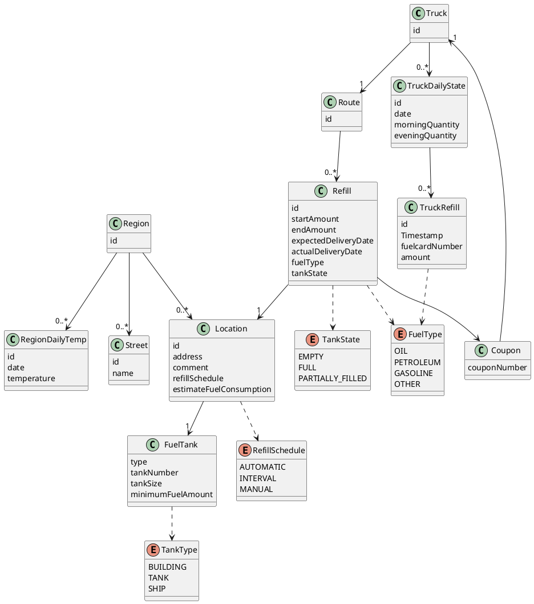

# Entity Datamodel

## Diagram

```plantuml
@startuml
class Truck {
  id
}

class Route {
  id
}

class Location {
  id
  address
  comment
  refillSchedule
  estimateFuelConsumption
}

class FuelTank {
  type
  tankNumber
  tankSize
  minimumFuelAmount
}

class Refill {
  id
  startAmount
  endAmount
  expectedDeliveryDate
  actualDeliveryDate
  fuelType
  tankState
}

class Region {
  id
}

class RegionDailyTemp {
  id
  date
  temperature
}

class TruckDailyState {
  id
  date
  morningQuantity
  eveningQuantity
}

class TruckRefill {
  id
  Timestamp
  fuelcardNumber
  amount
}

class Street {
  id
  name
}

enum FuelType {
  OIL
  PETROLEUM
  GASOLINE
  OTHER
}

enum TankType {
  BUILDING
  TANK
  SHIP
}

enum TankState {
  EMPTY
  FULL
  PARTIALLY_FILLED
}

enum RefillSchedule {
  AUTOMATIC
  INTERVAL
  MANUAL
}

class Coupon {
  couponNumber
}

Truck --> "1" Route
Route --> "0..*" Refill
Refill --> "1" Location
Refill --> Coupon
Refill ..> FuelType
FuelTank ..> TankType
Refill ..> TankState
Truck "1" <-- Coupon
Region --> "0..*" Location
Region --> "0..*" RegionDailyTemp
Truck --> "0..*" TruckDailyState
TruckDailyState --> "0..*" TruckRefill
TruckRefill ..> FuelType
Region --> "0..*" Street

Location --> "1" FuelTank
Location ..> RefillSchedule
@enduml

```

## Entities

### Building

### Coupon

### Refill

### Truck
